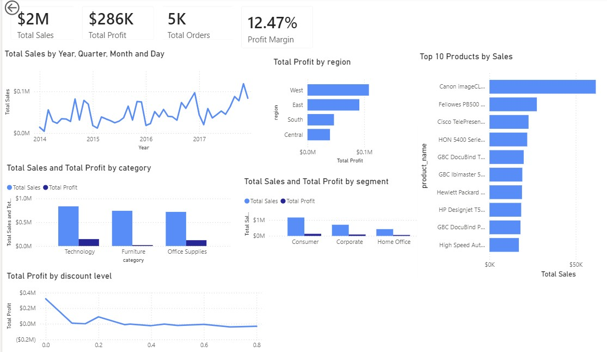

# Retail Sales Analysis Dashboard

## Project Overview

This project analyzes a retail sales dataset to uncover business insights related to sales performance, profitability, customer behavior, product performance, regional trends, shipping efficiency, and discount strategies.

The project demonstrates an end-to-end data analytics workflow using Python, SQL, and Power BI.

## Business Objectives

The project answers several business questions, including:

- Which products generate the highest revenue?
- Which products generate losses?
- Which customer segments are most profitable?
- Which regions perform best?
- How do discounts affect profitability?
- Which shipping methods perform best?
- How have sales changed over time?

## Tools & Technologies

- Python
- Pandas
- NumPy
- Matplotlib
- Seaborn
- SQLite
- SQL
- Power BI
- Git
- GitHub
- Jupyter Notebook

## Project Workflow

1. Data Collection
2. Data Cleaning
3. Exploratory Data Analysis
4. Business Analysis
5. SQL Analysis
6. Power BI Dashboard
7. Business Recommendations

## Project Structure

```text
Retail-Sales-Analysis/
│
├── data/
├── notebooks/
├── sql/
├── dashboard/
├── images/
├── presentation/
└── README.md
```

## Dashboard



## Key Insights

- Consumer customers generated the highest both total sales.
- Home Office customers achieved the highest profit margin.
- Standard Class accounted for the highest sales volume.
- Same Day shipping produced the highest average order value.
- High discount levels were associated with lower profitability.
- Technology products generated the strongest profits.

## Recommendations

- Continue investing in high-performing product categories.
- Review pricing strategies for products with negative profits.
- Optimize discount policies to improve profitability.
- Expand marketing efforts toward high-value customer segments.
- Promote premium shipping options for high-value purchases.

## Skills Demonstrated

- Data Cleaning
- Exploratory Data Analysis
- Business Analytics
- SQL Query Development
- Data Visualization
- Dashboard Design
- Business Storytelling
- Git Version Control

## Repository Contents

- Python notebooks
- SQL queries
- Power BI dashboard
- Business analysis
- Dashboard screenshots

## Contact

Maryam Allahyar

LinkedIn:
https://www.linkedin.com/in/maryam-allahyar-31a39b3ab/

GitHub:
https://github.com/MaryamAllahyar
